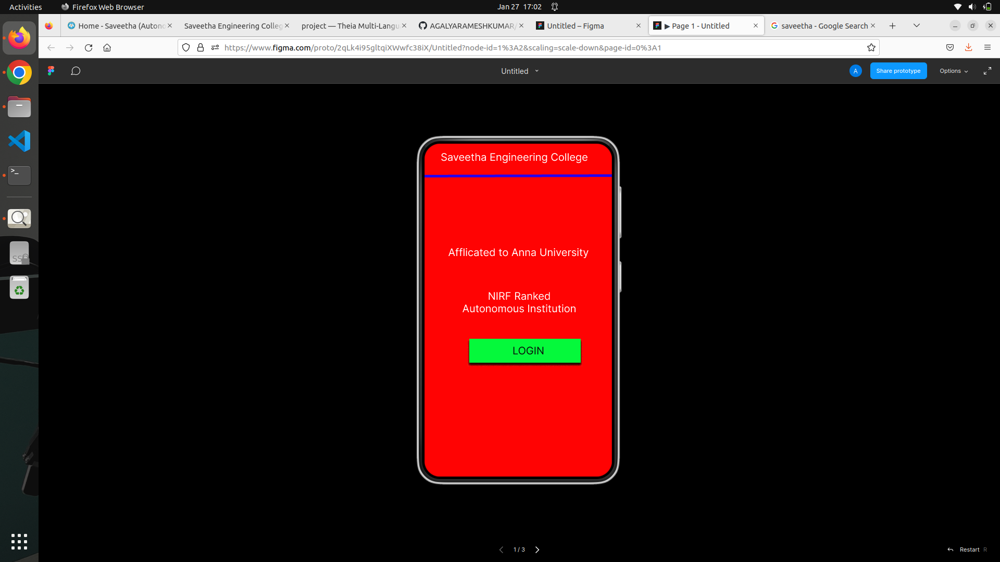
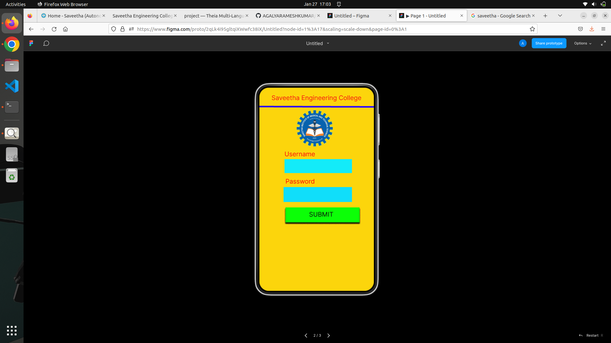
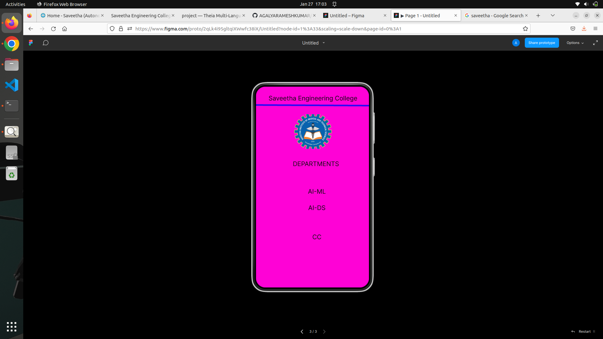

# Event Registration Web Application

## AIM:
To design, develop and deploy a web application for event registration.

## DESIGN STEPS:

### Step 1:
Create a new frame.

### Step 2:
Select any one preset size of your choice.

### Step 3:
Select the shapes you need.

### Step 4:
Import images as needed.

### Step 5:
Create pages based on your need and link them.

### Step 6:

Validate the HTML and CSS code.

### Step 6:

Publish the website in the given URL.

## DESIGN TOOL:
Figma

## code:
```
* home page */

position: relative;
width: 360px;
height: 640px;
background: #FF0303;

/* Login Page */
position: relative;
width: 360px;
height: 640px;
background: #FCD50C;

/* SEC Page */
position: relative;
width: 360px;
height: 640px;
text-align: center;
colour: #101010;

/* DEPARTMENTS */
position: absolute;
width: 324px;
height: 36px;
font-family: 'Inter';
font-style: normal;
font-weight: 400;
font-size: 20px;
text-align: center;
color: #101010;

/* AI-ML */
position: absolute;
width: 324px;
height: 36px;
height: 36px;
font-family: 'Inter';
font-style: normal;
font-weight: 400;
text-align: center;
color: #101010;

/* IOT */
position: absolute;
width: 324px;
heigth:36px;
font-family: 'Inter';
font-style: normal;
font-size: 20px;
text-align: center;
color: #101010;

/* CC */
position: absolute;
width: 324px;
height: 36px;
font-family: 'Inter';
font-style: normal;
font-size: 20px;
text-align: center;
color: #101010;

/* Logo 3 */
position: absolute;
width: 105px
height: 96px;
left: 127px
top: 117px;
background: url(Logo.png);
```
## OUTPUT:




## RESULT:
The program to design, develop and deploy a web application for event registration is completed successfully.